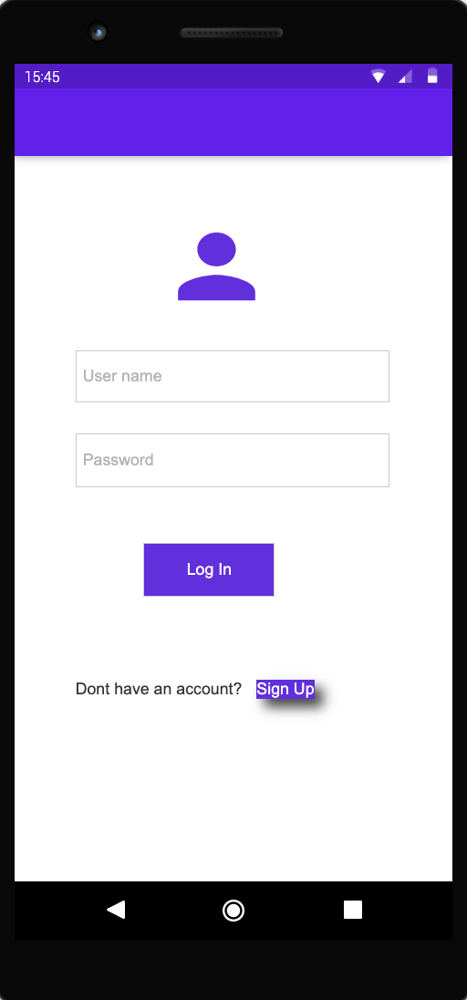
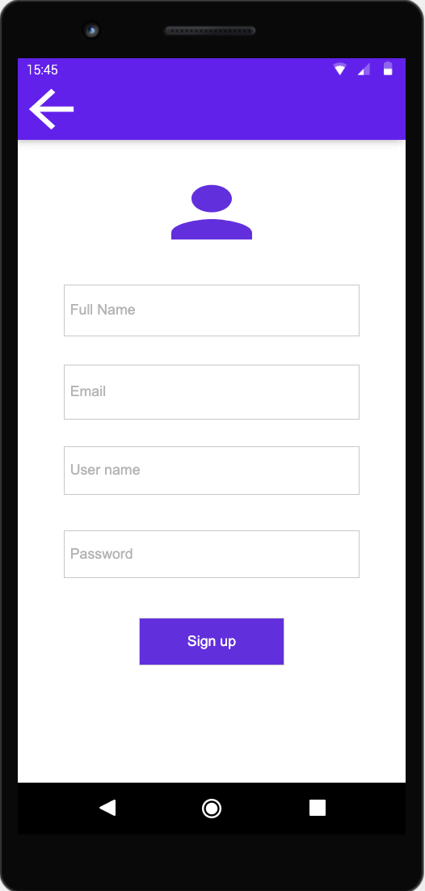
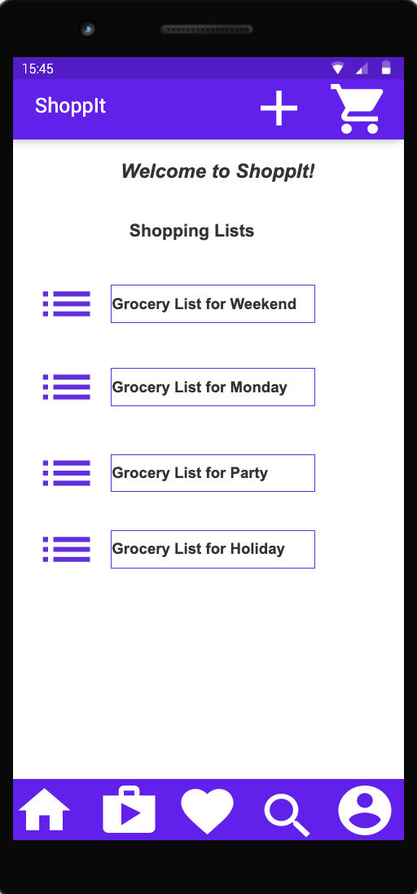
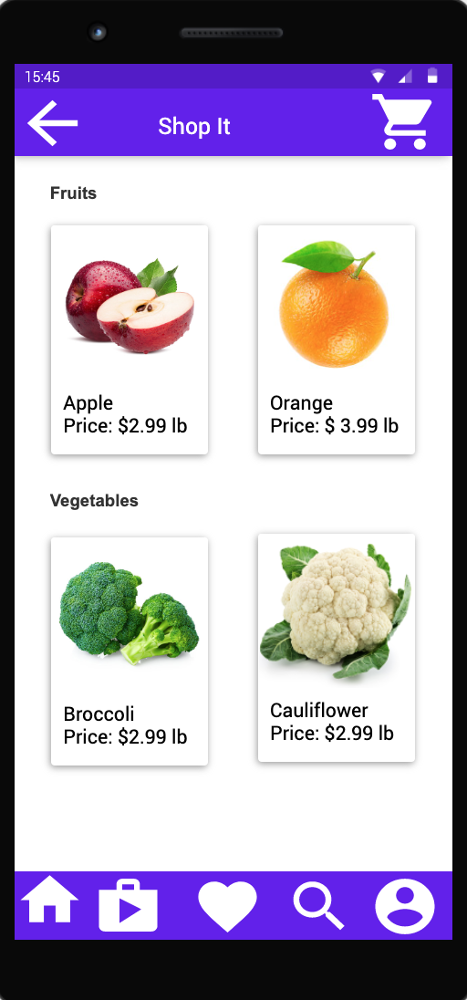
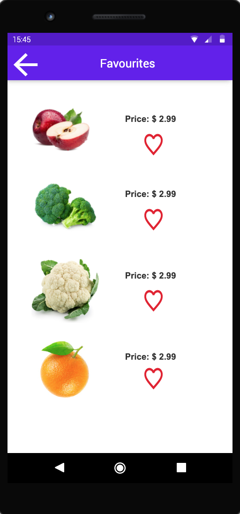
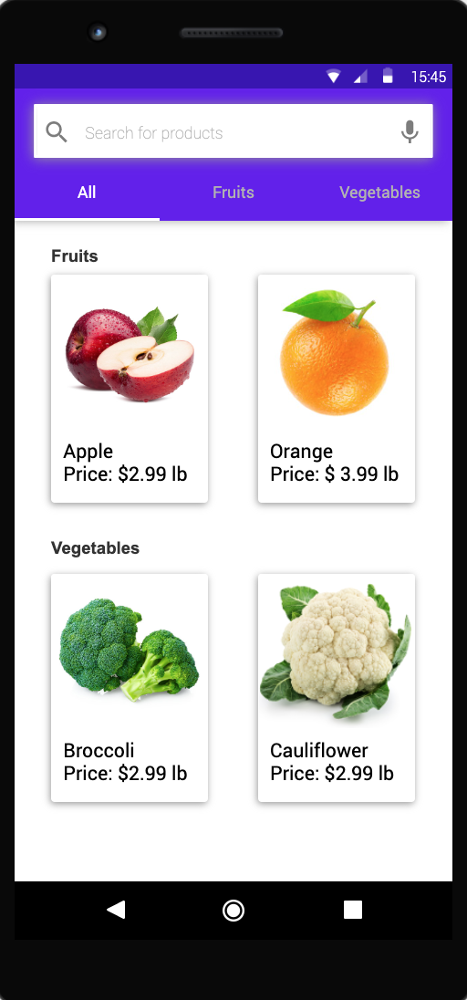
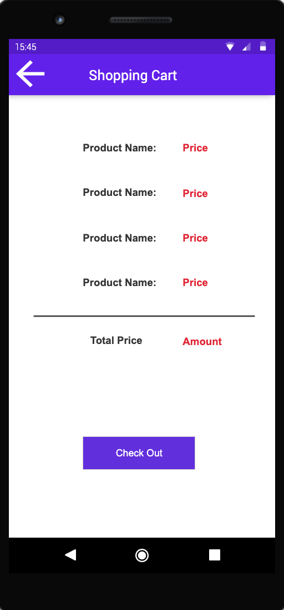
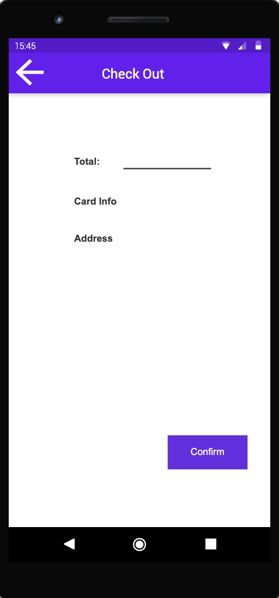
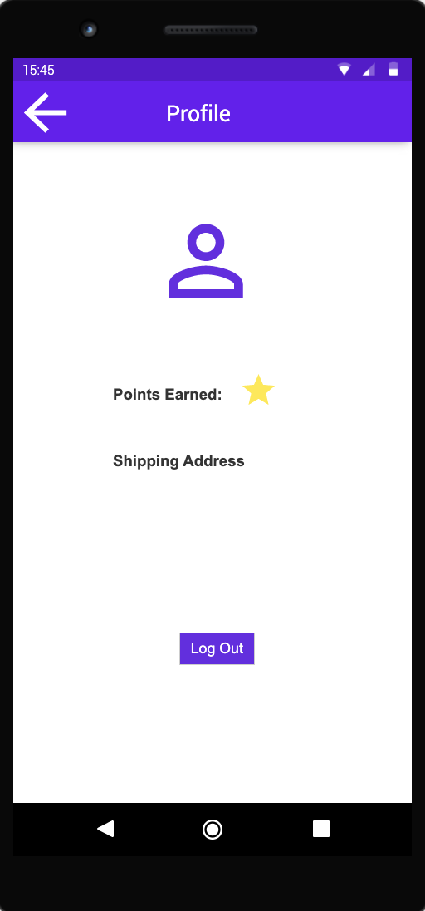
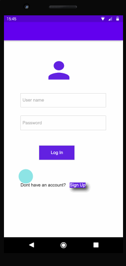

# SHOPPIT

## Table of Contents

1. [Overview](#Overview)
1. [Product Spec](#Product-Spec)
1. [Wireframes](#Wireframes)
1. [Schema](#Schema)

## Overview

### Description

_ShoppIt_ is an Android app that allows people to buy groceries online. To build the app, we used Android studio and Java. In this app, users can sign up, login, and logout from their account. They can revisit the same page after their app restarts. They are allowed to browse through the items and see the product info such as: category names, cost, availability, and expiration date. They can create separate categories to add, edit, and delete different items. People can order the products to their home and they are allowed to choose different shipping options during the checkout.

### App Evaluation

- **Category: Online shopping**
- **Mobile: Mobile is essential for the need of grocery. Users use the app to order products to their homes.**
- **Story: Create a list of grocery of products needed and added to the cart to make things easier. Allows users to purchase needed products to be delivered to their homes.**
- **Market: Anyone that loves online shopping could enjoy this app. Ability to browse through different categories and add it to cart according to preference and delivered to homes makes things easier for users as it eases users store trip.**
- **Habit: Users can order groceries online. Features like product info gives users an idea of the product they are purchasing. Users can browse through the items in any category they want and add it to their cart.**
- **Scope: “ShoppIt” will allow users to access different category of groceries and purchase groceries according to their requirements. It could actually be tested by people who loves online shopping. “X2” would incorporate users to list out their needed groceries that is not on the app.**

## Product Spec

### 1. User Stories (Required and Optional)

**Required Must-have Stories**

- User can sign up for an account
- User can login to the app
- User can logout from the app
- User can add/remove items to a shopping list
- User can checkout items to a shopping list
- User can see suggested items

**Optional Nice-to-have Stories**

- Shopping screen
- Checkout screen
- Account screen

### 2. Screen Archetypes

- Login Screen
- Register Screen
- Profile Screen
- Shopping Screen.
- Settings Screen
- Checkout screen
- Item Detail Screen

### 3. Navigation

**Tab Navigation** (Tab to Screen)

- List
- profile
- shopping
- Shopping Cart
  **Optional:**
- Searching bar

**Flow Navigation** (Screen to Screen)

- login -> signup -> default shopping view
- default shopping view -> item detail view -> add item to list
- shopping cart view -> checkout view -> shopping view
- Profile -> Account info/ purchase history.
- Settings -> Toggle settings
- logout -> login view

## Wireframes:


### [BONUS] Digital Wireframes & Mockups:

 


 


 


### [BONUS] Interactive Prototype:



## Schema

### Models

**Model: User**

| Property          | Type            | Description                                             |
| ----------------- | --------------- | ------------------------------------------------------- |
| userId (objectId) | String          | Unique id for the User object (default field) |
| password          | String          | Password created by the user to register for an account |
| email             | String          | Email that user uses to register                        |
| fullName          | String          | Users full name is required to sign up                  |
| profileImage      | File            | Profile Image that the user uses                        |
| pointsEarned      | Number          | Number of points that user accumulates                  |

**Model: Category**

| Property              | Type            | Description                                             |
| --------------------- | --------------- | ------------------------------------------------------- |
| categoryId (objectId) | String          | Unique id for the Category object (default field)       |
| categoryName          | String          | Unique category name for each type of products          |


### Networking
#### List of network requests by screen
- Login Screen:
    - (Read/GET) Read user info for authentication.
    
    ```swift
          private void loginUser(String username, String password) {
              Log.i(TAG, "Attempting to login user " + username);
              ParseUser.logInInBackground(username, password, new LogInCallback() {
                  @Override
                  public void done(ParseUser user, ParseException e) {
                      if (e != null){
                          Log.e(TAG, "Issue with login", e);
                          return;
                      }
                      goMainActivity();
                      Toast.makeText(LoginActivity.this, "Success!", Toast.LENGTH_SHORT).show();
                  }
              });
          }
    ```
- Signup Screen:
    - (Create/POST) Create a new User object.
        ```swift
          private void signUpUser(String username, String password) {
              Log.i(TAG, "Attempting to login user " + username);
              // Create the ParseUser
              ParseUser user = new ParseUser();
              // Set core properties
              user.setUsername(username);
              user.setPassword(password);
              user.signUpInBackground(new SignUpCallback() {
                  public void done(ParseException e) {
                      if (e == null) {
                          // Hooray! Let them use the app now.
                          goMainActivity();
                          Toast.makeText(LoginActivity.this, "Success!", Toast.LENGTH_SHORT).show();
                      } else {
                          // Sign up didn't succeed. Look at the ParseException
                          // to figure out what went wrong
                          Log.e(TAG, "Issue with login", e);
                          return;
                      }
                  }
              });
          }
        ```

- Home Screen:
    - (Read/GET) Retrieve all the Shopping Lists object created by a user.
        ```swift
          private void queryShoppingLists() {
              ParseQuery<ShoppingList> query = ParseQuery.getQuery(ShoppingList.class);
              query.include(ShoppingList.KEY_USER);
              query.setLimit(20); // if we want to set limit
              query.addDescendingOrder(KEY_CREATED_KEY);
              query.findInBackground(new FindCallback<ShoppingList>() {
                  @Override
                  public void done(List<ShoppingList> lists, ParseException e) {
                      if (e != null) {
                          Log.e(TAG, "Issue with getting shopping lists", e);
                          return;
                      }
                      for (ShoppingList list : lists) {
                          Log.i(TAG, "ShoppingList: " + list.getListName());
                      }
                      allShoppingLists.addAll(lists);
                      adapter.notifyDataSetChanged();
                  }
              });
          }
        ```
    - (Create/POST) Create a new Shopping List
    - (Delete) Delete a Shopping List

- Shop Online Screen:
    - (Read/GET) Retrieve all the Item object from the database
    ```swift
          private void queryItems() {
              ParseQuery<Item> query = ParseQuery.getQuery(Item.class);
              query.include("category");
              query.setLimit(20); // if we want to set limit
              query.addDescendingOrder("category");
              query.findInBackground(new FindCallback<Item>() {
                  @Override
                  public void done(List<Item> items, ParseException e) {
                      if (e != null) {
                          Log.e(TAG, "Issue with getting lists", e);
                          return;
                      }
                      for (Item item : items) {
                          Log.i(TAG, "Item: " + item.getListName());
                      }
                      allItems.addAll(items);
                      adapter.notifyDataSetChanged();
                  }
              });
          }
    ```
    - (Create/POST) Add an Item object to Favourite Item model
    - (Read/GET) Load more Items as user scrolls down

- Search Screen:
    - (Read/GET) Retrieve all the Items 
    - (Read/GET) Retrieve Items when searched by item name or category name
        ```swift
          protected void queryItemsByCategory(Category category) {
              ParseQuery<Item> query = ParseQuery.getQuery(Item.class);
              query.include(Item.KEY_CATEGORY);
              query.whereEqualTo(Item.KEY_CATEGORY, category);
              query.setLimit(20);
              query.addDescendingOrder(Item.KEY_ITEM_NAME);
              query.findInBackground(new FindCallback<Item>() {
                  @Override
                  public void done(List<Item> items, ParseException e) {
                      if (e != null) {
                          Log.e(TAG, "Issue with getting items by category", e);
                          return;
                      }
                      for (Item item : items) {
                          Log.i(TAG, item.getName);
                      }
                      allItemss.addAll(items);
                      adapter.notifyDataSetChanged();
                  }
         ```

- Item Details Screen:
    - (Read/GET) Get the details of an Item such as Item name, Category, price.

- ShoppingList Details Screen:
    - (Read/GET) Get all the Items is a shopping list
    - (Read/POST) Add an Item to a shopping list

- Favourite Screen:
    - (Read/GET) Retrieve all the favourite Items marked by the logged in User
    - (Update/UPDATE) Update the lists of favourite Items
    
- Account/Profile Screen:
    - (Read/GET) Retrieve logged in User object.
    - (Update/UPDATE) Update logged in user info.
